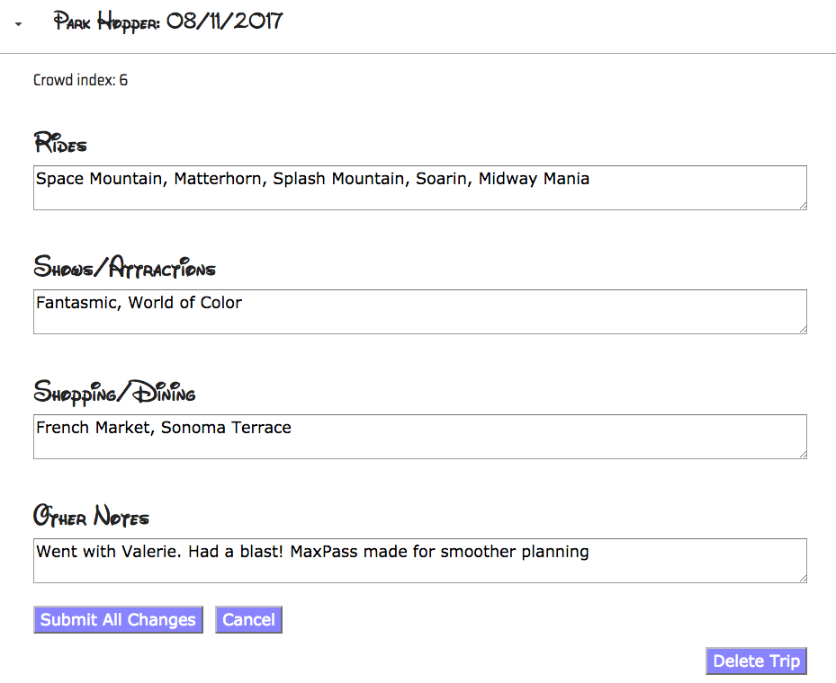

<h1>Park Hopper</h1>
<p><a href="https://park-hopper.herokuapp.com">Park Hopper</a> is a responsive, full-stack app which allows users to keep track of
their Disneyland visits.</p>
<br><br>

## Getting started
### Installing
```
>   git clone https://github.com/Ljyockey/park-hopper.git
>   cd hospitalert
>   npm install
```
### Launching
```
>   npm start
```
Then open [`localhost:8080`](http://localhost:8080) in a browser.
### Testing
```
>   npm test
```

<h2>Introduction</h2>
<p>The main focus of Park Hopper is to keep track of Disneyland visits using jornal-like entries.</p>

<h2>How it Works</h2>
<h3>Add a Trip</h3>

<p>Add a new trip for every visit. Basic information can be added like the date, crowd index, rides, shows, and shopping/dining.</p>
<h3>Edit and Delete Trips</h3>

<p>Most fields in a trip can be edited. Trips can also be deleted.</p>

<h2>Technology</h2>
<h3>Front End</h3>
<ul>
  <li>HTML5</li>
  <li>CSS3</li>
  <li>JavaScript</li>
  <li>jQuery</li>
</ul>
<h3>Back End</h3>
<ul>
  <li>Node.js + Express.js (web server)</li>
  <li>PostgreSQL (database)</li>
  <li><a href="https://mochajs.org/">Mocha</a> + <a href="http://chaijs.com/">Chai</a> (testing)</li>
  <li>Continuous integration and deployment with <a href="https://travis-ci.org/">Travis CI</a></li>
</ul>
<h3>API Routes</h3>
<ul>
  <li>GET (/trips)</li>
  <li>PUT (/trips/:id)</li>
  <li>POST (/trips)</li>
  <li>DELETE (/trips/:id)</li>
<h3>Responsive</h3>
<ul>
  <li>The app is fully responsive and quickly adapts to all mobile, tablet, and desktop viewports.</li>
</ul>

<h2>Current Release: V1</h2>
<p>V1 is a demo/MVP. V2 will introduce:</p>
<ul>
	<li>User accounts</li>
	<li>More theme parks</li>
	<li>Character Meet & Greets</li>
</ul>
<p>Park Hopper is open-source and contributions are always welcome!